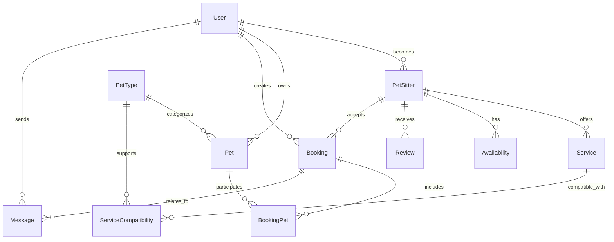

# Data Model: Pet Sitter Marketplace Platform

**Date**: November 12, 2025  
**Feature**: 001-pet-sitter-marketplace  
**Research Reference**: research.md  
**Phase**: 1 - Design & Contracts

---

## Entity Relationship Overview



---

## Core Entities

### 1. User Entity

**Purpose**: Central user identity supporting both pet owners and sitters  
**Key Relationships**: Base for PetSitter, owns Pets, creates Bookings

```csharp
public class User : BaseEntity
{
    [Required]
    [MaxLength(100)]
    public string FirstName { get; set; }
    
    [Required]
    [MaxLength(100)]
    public string LastName { get; set; }
    
    [Required]
    [EmailAddress]
    [MaxLength(255)]
    public string Email { get; set; }
    
    [Phone]
    public string PhoneNumber { get; set; }
    
    public string ProfileImageUrl { get; set; }
    
    [Required]
    public DateTime CreatedAt { get; set; }
    
    public DateTime? LastLoginAt { get; set; }
    
    public bool IsActive { get; set; } = true;
    
    // Navigation properties
    public List<Pet> Pets { get; set; } = new();
    public List<Booking> BookingsAsOwner { get; set; } = new();
    public List<Message> MessagesSent { get; set; } = new();
    public PetSitter SitterProfile { get; set; } // Optional sitter profile
    
    // Computed properties
    public string FullName => $"{FirstName} {LastName}";
    public bool IsPetSitter => SitterProfile != null;
}
```

**Indexes**:
- Clustered: `Id`
- Non-clustered: `Email` (unique), `IsActive, CreatedAt`

---

### 2. PetSitter Entity

**Purpose**: Extended profile for users offering pet sitting services  
**Key Features**: Location, availability, services, ratings

```csharp
public class PetSitter : BaseEntity
{
    [Required]
    public string UserId { get; set; }
    public User User { get; set; }
    
    [MaxLength(1000)]
    public string Bio { get; set; }
    
    [Required]
    public LocationCoordinates Location { get; set; } // Complex type
    
    public decimal HourlyRate { get; set; }
    
    public bool IsAvailableForEmergencies { get; set; }
    
    public int MaxPetsAtOnce { get; set; } = 1;
    
    public DateTime? BackgroundCheckDate { get; set; }
    
    public bool IsVerified { get; set; }
    
    [Required]
    public DateTime CreatedAt { get; set; }
    
    public DateTime? LastActiveAt { get; set; }
    
    // Navigation properties
    public List<Service> ServicesOffered { get; set; } = new();
    public List<PetTypeSpecialty> PetTypeSpecialties { get; set; } = new();
    public List<Availability> AvailabilitySlots { get; set; } = new();
    public List<Review> ReviewsReceived { get; set; } = new();
    public List<Booking> BookingsReceived { get; set; } = new();
    
    // Computed properties
    public decimal AverageRating => ReviewsReceived.Any() ? 
        ReviewsReceived.Average(r => r.Rating) : 0;
    public int TotalReviews => ReviewsReceived.Count;
    public int CompletedBookings => BookingsReceived.Count(b => b.Status == BookingStatus.Completed);
}

// Complex type for location data
[ComplexType]
public class LocationCoordinates
{
    [Required]
    public double Latitude { get; set; }
    
    [Required]
    public double Longitude { get; set; }
    
    [Required]
    [MaxLength(255)]
    public string Address { get; set; }
    
    [MaxLength(100)]
    public string City { get; set; }
    
    [MaxLength(50)]
    public string State { get; set; }
    
    [MaxLength(20)]
    public string ZipCode { get; set; }
    
    // Helper methods
    public double DistanceFrom(LocationCoordinates other) =>
        CalculateHaversineDistance(this, other);
        
    public bool IsWithinRadius(LocationCoordinates center, double radiusMiles) =>
        DistanceFrom(center) <= radiusMiles;
        
    public LocationCoordinates Approximate(double radiusMiles)
    {
        // Return approximate location for privacy
        var offset = radiusMiles / 69.0; // Rough miles to degrees conversion
        return new LocationCoordinates
        {
            Latitude = Math.Round(Latitude + (Random.Shared.NextDouble() - 0.5) * offset, 3),
            Longitude = Math.Round(Longitude + (Random.Shared.NextDouble() - 0.5) * offset, 3),
            City = City,
            State = State,
            Address = "[Approximate location]"
        };
    }
}
```

**Indexes**:
- Spatial: `Location` (Latitude, Longitude) for geographic queries
- Non-clustered: `UserId` (unique), `IsVerified, LastActiveAt`, `Location.City, Location.State`

---

### 3. Pet Entity

**Purpose**: Represents pets owned by users  
**Key Features**: Multiple pet types, special needs, photos

```csharp
public class Pet : BaseEntity
{
    [Required]
    public string OwnerId { get; set; }
    public User Owner { get; set; }
    
    [Required]
    [MaxLength(100)]
    public string Name { get; set; }
    
    [Required]
    public string PetTypeId { get; set; }
    public PetType PetType { get; set; }
    
    [MaxLength(100)]
    public string Breed { get; set; }
    
    public int AgeMonths { get; set; }
    
    public PetGender Gender { get; set; }
    
    public decimal WeightPounds { get; set; }
    
    public bool IsSpayedNeutered { get; set; }
    
    public string PhotoUrl { get; set; }
    
    [MaxLength(1000)]
    public string SpecialNeeds { get; set; }
    
    [MaxLength(500)]
    public string MedicalConditions { get; set; }
    
    [MaxLength(500)]
    public string BehaviorNotes { get; set; }
    
    public bool IsActive { get; set; } = true;
    
    [Required]
    public DateTime CreatedAt { get; set; }
    
    // Navigation properties
    public List<BookingPet> BookingParticipations { get; set; } = new();
    
    // Computed properties
    public int AgeYears => AgeMonths / 12;
    public string AgeDescription => AgeYears > 0 ? 
        $"{AgeYears} year{(AgeYears != 1 ? "s" : "")}" : 
        $"{AgeMonths} month{(AgeMonths != 1 ? "s" : "")}";
}

public enum PetGender
{
    Male,
    Female,
    Unknown
}
```

**Indexes**:
- Non-clustered: `OwnerId, IsActive`, `PetTypeId`

---

### 4. PetType Entity

**Purpose**: Configurable pet type system supporting various animals  
**Key Features**: Hierarchical categories, service compatibility

```csharp
public class PetType : BaseEntity
{
    [Required]
    [MaxLength(100)]
    public string Name { get; set; }
    
    [MaxLength(50)]
    public string Category { get; set; } // mammal, bird, reptile, fish, exotic
    
    [MaxLength(500)]
    public string Description { get; set; }
    
    public string IconUrl { get; set; }
    
    public bool RequiresSpecialLicense { get; set; }
    
    public bool IsCommonPet { get; set; } = true;
    
    public int SortOrder { get; set; }
    
    // Navigation properties
    public List<Pet> Pets { get; set; } = new();
    public List<ServiceCompatibility> CompatibleServices { get; set; } = new();
    public List<PetTypeSpecialty> SitterSpecialties { get; set; } = new();
}
```

**Indexes**:
- Non-clustered: `Category, SortOrder`, `IsCommonPet`

---

### 5. Service Entity

**Purpose**: Services offered by pet sitters  
**Key Features**: Flexible pricing, duration, pet compatibility

```csharp
public class Service : BaseEntity
{
    [Required]
    public string PetSitterId { get; set; }
    public PetSitter PetSitter { get; set; }
    
    [Required]
    [MaxLength(100)]
    public string ServiceType { get; set; } // dog-walking, pet-sitting, boarding, etc.
    
    [Required]
    [MaxLength(200)]
    public string Title { get; set; }
    
    [MaxLength(1000)]
    public string Description { get; set; }
    
    [Required]
    public decimal BasePrice { get; set; }
    
    [Required]
    public PricingModel PricingModel { get; set; } // PerHour, PerDay, PerVisit, Flat
    
    public int? DurationMinutes { get; set; }
    
    public bool IsAvailable { get; set; } = true;
    
    [Required]
    public DateTime CreatedAt { get; set; }
    
    // Navigation properties  
    public List<ServiceCompatibility> PetTypeCompatibilities { get; set; } = new();
    
    // Computed properties
    public string DurationDisplay => DurationMinutes.HasValue ? 
        $"{DurationMinutes / 60}h {DurationMinutes % 60}m" : 
        "Variable duration";
}

public enum PricingModel
{
    PerHour,
    PerDay,
    PerVisit,
    Flat
}
```

**Indexes**:
- Non-clustered: `PetSitterId, IsAvailable`, `ServiceType`

---

### 6. ServiceCompatibility Entity

**Purpose**: Junction table defining which services work with which pet types  
**Key Features**: Many-to-many with additional constraints

```csharp
public class ServiceCompatibility : BaseEntity
{
    [Required]
    public string ServiceId { get; set; }
    public Service Service { get; set; }
    
    [Required]
    public string PetTypeId { get; set; }
    public PetType PetType { get; set; }
    
    public bool RequiresSpecialSkills { get; set; }
    
    public decimal? PriceAdjustment { get; set; } // Additional fee for this pet type
    
    [MaxLength(500)]
    public string AdditionalRequirements { get; set; }
}
```

**Indexes**:
- Composite: `ServiceId, PetTypeId` (unique)

---

### 7. Availability Entity

**Purpose**: Sitter availability scheduling  
**Key Features**: Recurring patterns, time slots, booking conflicts

```csharp
public class Availability : BaseEntity
{
    [Required]
    public string PetSitterId { get; set; }
    public PetSitter PetSitter { get; set; }
    
    [Required]
    public DateOnly AvailableDate { get; set; }
    
    [Required]
    public TimeOnly StartTime { get; set; }
    
    [Required]
    public TimeOnly EndTime { get; set; }
    
    public bool IsRecurring { get; set; }
    
    public DayOfWeek? RecurringDayOfWeek { get; set; }
    
    public DateTime? RecurringUntilDate { get; set; }
    
    public bool IsAvailable { get; set; } = true; // Can be blocked by bookings
    
    public bool IsBlocked { get; set; } // Manually blocked by sitter
    
    [MaxLength(200)]
    public string Notes { get; set; }
    
    // Computed properties
    public DateTime StartDateTime => AvailableDate.ToDateTime(StartTime);
    public DateTime EndDateTime => AvailableDate.ToDateTime(EndTime);
    public TimeSpan Duration => EndDateTime - StartDateTime;
    
    public bool OverlapsWith(DateTime requestStart, DateTime requestEnd) =>
        StartDateTime < requestEnd && EndDateTime > requestStart;
}
```

**Indexes**:
- Composite: `PetSitterId, AvailableDate, IsAvailable` (unique)
- Non-clustered: `AvailableDate, IsAvailable`

---

### 8. Booking Entity

**Purpose**: Core marketplace transaction  
**Key Features**: Status workflow, multiple pets, pricing calculation

```csharp
public class Booking : BaseEntity
{
    [Required]
    public string PetOwnerId { get; set; }
    public User PetOwner { get; set; }
    
    [Required]
    public string PetSitterId { get; set; }
    public PetSitter PetSitter { get; set; }
    
    [Required]
    public string ServiceId { get; set; }
    public Service Service { get; set; }
    
    [Required]
    public DateTime StartDateTime { get; set; }
    
    [Required]
    public DateTime EndDateTime { get; set; }
    
    [Required]
    public BookingStatus Status { get; set; } = BookingStatus.Pending;
    
    [Required]
    public decimal TotalCost { get; set; }
    
    [MaxLength(1000)]
    public string SpecialInstructions { get; set; }
    
    [MaxLength(1000)]
    public string CancellationReason { get; set; }
    
    public DateTime? CancelledAt { get; set; }
    
    [Required]
    public DateTime CreatedAt { get; set; }
    
    public DateTime? AcceptedAt { get; set; }
    
    public DateTime? CompletedAt { get; set; }
    
    // Navigation properties
    public List<BookingPet> PetsIncluded { get; set; } = new();
    public List<Message> Messages { get; set; } = new();
    public List<BookingStatusHistory> StatusHistory { get; set; } = new();
    
    // Computed properties
    public TimeSpan Duration => EndDateTime - StartDateTime;
    public bool IsActive => Status.IsActiveStatus();
    public bool CanBeCancelled => Status.CanTransitionTo(BookingStatus.Cancelled);
}

public enum BookingStatus
{
    Pending,
    Accepted,
    Declined,
    Confirmed,
    InProgress,
    Completed,
    Cancelled
}

// Extension methods for status logic
public static class BookingStatusExtensions
{
    public static bool IsActiveStatus(this BookingStatus status) =>
        status is BookingStatus.Accepted or BookingStatus.Confirmed or BookingStatus.InProgress;
        
    public static bool CanTransitionTo(this BookingStatus current, BookingStatus target) =>
        AllowedTransitions.GetValueOrDefault(current, new List<BookingStatus>()).Contains(target);
        
    private static readonly Dictionary<BookingStatus, List<BookingStatus>> AllowedTransitions = new()
    {
        { BookingStatus.Pending, new() { BookingStatus.Accepted, BookingStatus.Declined, BookingStatus.Cancelled } },
        { BookingStatus.Accepted, new() { BookingStatus.Confirmed, BookingStatus.Cancelled } },
        { BookingStatus.Confirmed, new() { BookingStatus.InProgress, BookingStatus.Cancelled } },
        { BookingStatus.InProgress, new() { BookingStatus.Completed } },
        // Terminal states have no transitions
    };
}
```

**Indexes**:
- Non-clustered: `PetOwnerId, Status`, `PetSitterId, Status`, `Status, StartDateTime`
- Composite: `PetSitterId, StartDateTime, EndDateTime` for overlap detection

---

### 9. BookingPet Entity

**Purpose**: Junction table linking bookings to specific pets  
**Key Features**: Many-to-many with pet-specific pricing

```csharp
public class BookingPet : BaseEntity
{
    [Required]
    public string BookingId { get; set; }
    public Booking Booking { get; set; }
    
    [Required]
    public string PetId { get; set; }
    public Pet Pet { get; set; }
    
    public decimal PetSpecificCost { get; set; } // Additional cost for this specific pet
    
    [MaxLength(500)]
    public string PetSpecificInstructions { get; set; }
}
```

**Indexes**:
- Composite: `BookingId, PetId` (unique)

---

### 10. Review Entity

**Purpose**: Feedback system for completed bookings  
**Key Features**: Bidirectional reviews, structured feedback

```csharp
public class Review : BaseEntity
{
    [Required]
    public string BookingId { get; set; }
    public Booking Booking { get; set; }
    
    [Required]
    public string ReviewerId { get; set; } // User who wrote the review
    public User Reviewer { get; set; }
    
    [Required]
    public string RevieweeId { get; set; } // PetSitter being reviewed  
    public PetSitter Reviewee { get; set; }
    
    [Required]
    [Range(1, 5)]
    public int Rating { get; set; }
    
    [MaxLength(1000)]
    public string Comment { get; set; }
    
    public bool WouldRecommend { get; set; }
    
    [Required]
    public DateTime CreatedAt { get; set; }
    
    // Structured feedback
    public int CommunicationRating { get; set; }
    public int ReliabilityRating { get; set; }
    public int PetCareRating { get; set; }
}
```

**Indexes**:
- Non-clustered: `RevieweeId, CreatedAt`, `BookingId` (unique)

---

### 11. Message Entity

**Purpose**: Communication system between pet owners and sitters  
**Key Features**: Booking-context messaging, media attachments

```csharp
public class Message : BaseEntity
{
    [Required]
    public string SenderId { get; set; }
    public User Sender { get; set; }
    
    [Required]
    public string ReceiverId { get; set; }
    public User Receiver { get; set; }
    
    public string BookingId { get; set; } // Optional booking context
    public Booking Booking { get; set; }
    
    [Required]
    [MaxLength(2000)]
    public string Content { get; set; }
    
    public string AttachmentUrl { get; set; }
    
    public MessageType Type { get; set; } = MessageType.Text;
    
    public bool IsRead { get; set; }
    
    [Required]
    public DateTime SentAt { get; set; }
    
    public DateTime? ReadAt { get; set; }
}

public enum MessageType
{
    Text,
    Image,
    Document,
    SystemNotification
}
```

**Indexes**:
- Non-clustered: `SenderId, SentAt`, `ReceiverId, IsRead`, `BookingId`

---

### 12. Support Entities

#### PetTypeSpecialty Entity
```csharp
public class PetTypeSpecialty : BaseEntity
{
    [Required]
    public string PetSitterId { get; set; }
    public PetSitter PetSitter { get; set; }
    
    [Required]
    public string PetTypeId { get; set; }
    public PetType PetType { get; set; }
    
    public int ExperienceYears { get; set; }
    
    public bool HasSpecialTraining { get; set; }
    
    [MaxLength(500)]
    public string Certifications { get; set; }
}
```

#### BookingStatusHistory Entity
```csharp
public class BookingStatusHistory : BaseEntity
{
    [Required]
    public string BookingId { get; set; }
    public Booking Booking { get; set; }
    
    [Required]
    public BookingStatus FromStatus { get; set; }
    
    [Required]
    public BookingStatus ToStatus { get; set; }
    
    [MaxLength(500)]
    public string Reason { get; set; }
    
    [Required]
    public DateTime ChangedAt { get; set; }
    
    [Required]
    public string ChangedBy { get; set; } // User ID who made the change
}
```

---

## Base Entity Pattern

```csharp
public abstract class BaseEntity
{
    [Key]
    public string Id { get; set; } = Guid.NewGuid().ToString();
    
    [Timestamp]
    public byte[] RowVersion { get; set; }
    
    // Audit fields (could be in separate interface)
    public DateTime CreatedAt { get; set; } = DateTime.UtcNow;
    public DateTime UpdatedAt { get; set; } = DateTime.UtcNow;
}
```

---

## Database Context Configuration

```csharp
public class MarketplaceDbContext : DbContext
{
    public MarketplaceDbContext(DbContextOptions<MarketplaceDbContext> options) : base(options) { }
    
    // DbSets
    public DbSet<User> Users { get; set; }
    public DbSet<PetSitter> PetSitters { get; set; }
    public DbSet<Pet> Pets { get; set; }
    public DbSet<PetType> PetTypes { get; set; }
    public DbSet<Service> Services { get; set; }
    public DbSet<ServiceCompatibility> ServiceCompatibilities { get; set; }
    public DbSet<Availability> Availabilities { get; set; }
    public DbSet<Booking> Bookings { get; set; }
    public DbSet<BookingPet> BookingPets { get; set; }
    public DbSet<Review> Reviews { get; set; }
    public DbSet<Message> Messages { get; set; }
    public DbSet<PetTypeSpecialty> PetTypeSpecialties { get; set; }
    public DbSet<BookingStatusHistory> BookingStatusHistories { get; set; }
    
    protected override void OnModelCreating(ModelBuilder modelBuilder)
    {
        base.OnModelCreating(modelBuilder);
        
        // Configure relationships
        ConfigureUserRelationships(modelBuilder);
        ConfigurePetSitterRelationships(modelBuilder);
        ConfigureBookingRelationships(modelBuilder);
        ConfigureIndexes(modelBuilder);
        ConfigurePrecisionAndConstraints(modelBuilder);
        
        // Seed initial data
        SeedPetTypes(modelBuilder);
    }
    
    private void ConfigureUserRelationships(ModelBuilder modelBuilder)
    {
        modelBuilder.Entity<User>()
            .HasIndex(u => u.Email)
            .IsUnique();
            
        modelBuilder.Entity<PetSitter>()
            .HasOne(ps => ps.User)
            .WithOne(u => u.SitterProfile)
            .HasForeignKey<PetSitter>(ps => ps.UserId)
            .OnDelete(DeleteBehavior.Cascade);
    }
    
    private void ConfigurePetSitterRelationships(ModelBuilder modelBuilder)
    {
        modelBuilder.Entity<PetSitter>()
            .OwnsOne(ps => ps.Location, location =>
            {
                location.Property(l => l.Latitude).HasPrecision(18, 6);
                location.Property(l => l.Longitude).HasPrecision(18, 6);
            });
    }
    
    private void ConfigureBookingRelationships(ModelBuilder modelBuilder)
    {
        // Booking to User relationships
        modelBuilder.Entity<Booking>()
            .HasOne(b => b.PetOwner)
            .WithMany(u => u.BookingsAsOwner)
            .HasForeignKey(b => b.PetOwnerId)
            .OnDelete(DeleteBehavior.Restrict);
            
        modelBuilder.Entity<Booking>()
            .HasOne(b => b.PetSitter)
            .WithMany(ps => ps.BookingsReceived)
            .HasForeignKey(b => b.PetSitterId)
            .OnDelete(DeleteBehavior.Restrict);
        
        // BookingPet junction configuration
        modelBuilder.Entity<BookingPet>()
            .HasIndex(bp => new { bp.BookingId, bp.PetId })
            .IsUnique();
    }
    
    private void ConfigureIndexes(ModelBuilder modelBuilder)
    {
        // Spatial index for location-based queries
        modelBuilder.Entity<PetSitter>()
            .HasIndex(ps => new { ps.Location.Latitude, ps.Location.Longitude });
            
        // Composite indexes for common query patterns
        modelBuilder.Entity<Availability>()
            .HasIndex(a => new { a.PetSitterId, a.AvailableDate, a.IsAvailable })
            .IsUnique();
            
        modelBuilder.Entity<Booking>()
            .HasIndex(b => new { b.PetSitterId, b.StartDateTime, b.EndDateTime });
    }
    
    private void ConfigurePrecisionAndConstraints(ModelBuilder modelBuilder)
    {
        modelBuilder.Entity<Service>()
            .Property(s => s.BasePrice)
            .HasPrecision(18, 2);
            
        modelBuilder.Entity<Booking>()
            .Property(b => b.TotalCost)
            .HasPrecision(18, 2);
            
        modelBuilder.Entity<PetSitter>()
            .Property(ps => ps.HourlyRate)
            .HasPrecision(18, 2);
    }
    
    private void SeedPetTypes(ModelBuilder modelBuilder)
    {
        var petTypes = new[]
        {
            new PetType { Id = "dog", Name = "Dog", Category = "mammal", IsCommonPet = true, SortOrder = 1 },
            new PetType { Id = "cat", Name = "Cat", Category = "mammal", IsCommonPet = true, SortOrder = 2 },
            new PetType { Id = "bird", Name = "Bird", Category = "bird", IsCommonPet = true, SortOrder = 3 },
            new PetType { Id = "fish", Name = "Fish", Category = "fish", IsCommonPet = true, SortOrder = 4 },
            new PetType { Id = "rabbit", Name = "Rabbit", Category = "mammal", IsCommonPet = true, SortOrder = 5 },
            new PetType { Id = "hamster", Name = "Hamster", Category = "mammal", IsCommonPet = true, SortOrder = 6 },
            new PetType { Id = "reptile", Name = "Reptile", Category = "reptile", IsCommonPet = false, SortOrder = 7 },
            new PetType { Id = "exotic", Name = "Exotic Pet", Category = "exotic", IsCommonPet = false, RequiresSpecialLicense = true, SortOrder = 8 }
        };
        
        modelBuilder.Entity<PetType>().HasData(petTypes);
    }
}
```

---

## Query Performance Considerations

### 1. Geographic Search Optimization
```sql
-- Spatial index for location-based queries
CREATE SPATIAL INDEX IX_PetSitter_Location 
ON PetSitters (Location);

-- Optimized sitter search query
SELECT ps.*, AVG(r.Rating) as AverageRating, COUNT(r.Id) as ReviewCount
FROM PetSitters ps
LEFT JOIN Reviews r ON ps.Id = r.RevieweeId
WHERE ps.Location.STDistance(geography::Point(@lat, @lng, 4326)) <= @radiusMeters
    AND ps.IsVerified = 1
    AND EXISTS (
        SELECT 1 FROM ServiceCompatibilities sc 
        JOIN Services s ON sc.ServiceId = s.Id 
        WHERE s.PetSitterId = ps.Id AND sc.PetTypeId = @petTypeId
    )
GROUP BY ps.Id, ps.UserId, ps.Bio, ps.Location, ps.HourlyRate, ps.IsVerified
ORDER BY ps.Location.STDistance(geography::Point(@lat, @lng, 4326));
```

### 2. Availability Conflict Detection
```sql
-- Prevent double-booking with availability overlap check
CREATE INDEX IX_Booking_SitterDateRange 
ON Bookings (PetSitterId, StartDateTime, EndDateTime) 
WHERE Status IN ('Accepted', 'Confirmed', 'InProgress');

-- Availability conflict query
SELECT COUNT(*) as ConflictCount
FROM Bookings b
WHERE b.PetSitterId = @sitterId
    AND b.Status IN ('Accepted', 'Confirmed', 'InProgress')
    AND b.StartDateTime < @requestEnd
    AND b.EndDateTime > @requestStart;
```

### 3. Review Aggregation Optimization
```sql
-- Materialized view for sitter ratings (could be computed column)
ALTER TABLE PetSitters 
ADD AverageRating AS (
    SELECT COALESCE(AVG(CAST(r.Rating AS DECIMAL)), 0)
    FROM Reviews r 
    WHERE r.RevieweeId = Id
) PERSISTED;
```

---

## Data Seeding Strategy

### Development Seed Data
```csharp
public static class SeedData
{
    public static void SeedDevelopmentData(MarketplaceDbContext context)
    {
        if (context.Users.Any()) return; // Already seeded
        
        var users = CreateSampleUsers();
        var petSitters = CreateSamplePetSitters(users);
        var pets = CreateSamplePets(users);
        var services = CreateSampleServices(petSitters);
        var bookings = CreateSampleBookings(users, petSitters, services, pets);
        
        context.Users.AddRange(users);
        context.PetSitters.AddRange(petSitters);
        context.Pets.AddRange(pets);
        context.Services.AddRange(services);
        context.Bookings.AddRange(bookings);
        
        context.SaveChanges();
    }
    
    private static List<User> CreateSampleUsers() => new()
    {
        new User 
        { 
            Id = "user-001", 
            FirstName = "John", 
            LastName = "Doe", 
            Email = "john.doe@example.com",
            PhoneNumber = "555-0101",
            CreatedAt = DateTime.UtcNow.AddDays(-30)
        },
        new User 
        { 
            Id = "user-002", 
            FirstName = "Sarah", 
            LastName = "Johnson", 
            Email = "sarah.johnson@example.com",
            PhoneNumber = "555-0102",
            CreatedAt = DateTime.UtcNow.AddDays(-25)
        }
        // ... additional sample users
    };
    
    private static List<PetSitter> CreateSamplePetSitters(List<User> users) => new()
    {
        new PetSitter
        {
            Id = "sitter-001",
            UserId = "user-002",
            Bio = "Experienced dog walker with 5+ years of pet care experience",
            Location = new LocationCoordinates 
            { 
                Latitude = 47.6062, 
                Longitude = -122.3321,
                Address = "123 Main St",
                City = "Seattle",
                State = "WA",
                ZipCode = "98101"
            },
            HourlyRate = 25.00m,
            IsVerified = true,
            MaxPetsAtOnce = 3,
            CreatedAt = DateTime.UtcNow.AddDays(-20)
        }
        // ... additional sample sitters
    };
}
```

---

## Migration Strategy

### Initial Migration
```csharp
public partial class InitialMarketplaceMigration : Migration
{
    protected override void Up(MigrationBuilder migrationBuilder)
    {
        // Create tables in dependency order
        CreateUserTables(migrationBuilder);
        CreatePetTables(migrationBuilder);
        CreateSitterTables(migrationBuilder);
        CreateBookingTables(migrationBuilder);
        CreateMessagingTables(migrationBuilder);
        CreateIndexes(migrationBuilder);
    }
    
    private void CreateIndexes(MigrationBuilder migrationBuilder)
    {
        // Geographic indexes
        migrationBuilder.Sql(@"
            CREATE SPATIAL INDEX IX_PetSitter_Location 
            ON PetSitters (Location)");
            
        // Performance indexes  
        migrationBuilder.CreateIndex(
            name: "IX_Booking_SitterStatus",
            table: "Bookings",
            columns: new[] { "PetSitterId", "Status", "StartDateTime" });
    }
}
```

---

## Summary

This comprehensive data model provides the foundation for a full-featured pet sitter marketplace with:

- **Flexible pet type support** beyond just dogs and cats
- **Robust booking system** with state management and conflict prevention
- **Geographic search capabilities** with spatial indexing
- **Comprehensive review and rating system**
- **Secure messaging between users**
- **Scalable availability management**

The model is designed for high performance with appropriate indexing strategies and follows Entity Framework Core best practices for maintainability and extensibility.